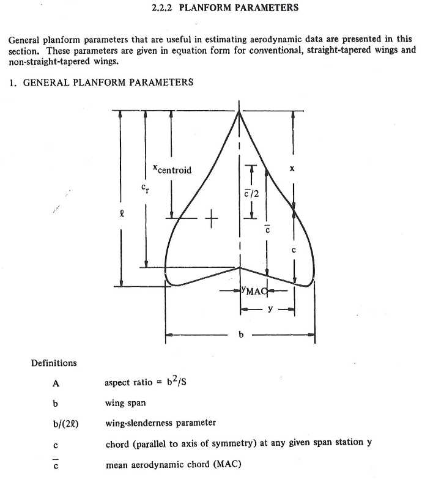
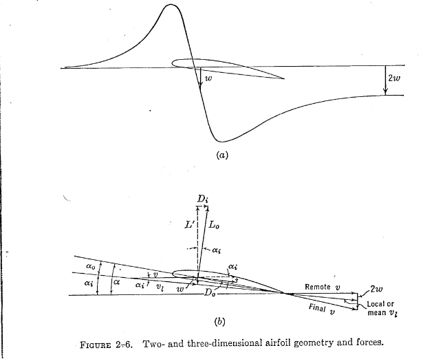
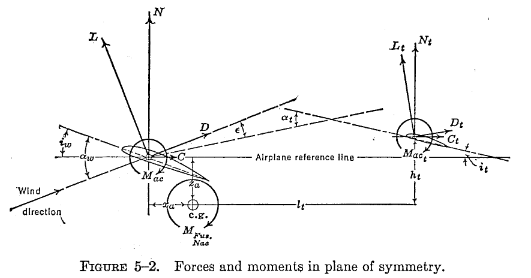
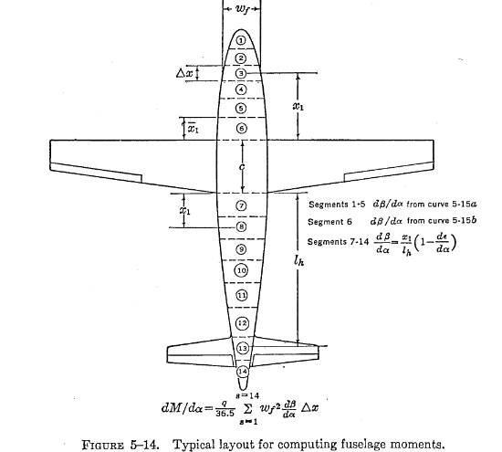
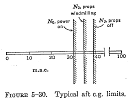

# Stability-Analysis-of-an-Aircraft
This repository contains code developed for the Stability Control Analysis of a D18 Beechcraft aircraft. 
Note: The Datcom manual was extensively used as a reference for the necessary graphs and data.
Topics Covered:

 1. Planform Geometric Parameterization

  
  Objective: Determine the aircraft's basic physical geometry, such as the theoretical wing area, span of the aircraft, mean chord length and location, etc... 

  Details: The PlanformParameterization object in the code is designed specifically for lifting surfaces like wings or horizontal tails (HT).
  

Fig 1. Datcom Manual page 2.2.2-1

2. Planform Aerodynamic Parameterization 

Objective: Apply aerodynamic parameterization to wing and HT but, it Can aslo be applied other planform such as Vertical Tails (VT) and Canards.   

Details: The code adjusts 2D (lower-case subscripts) aerodynamic parameters to 3D (upper-case subscripts). Experimental data, such as the lift curve slope, the coefficient of moment about the aerodynamic center, the zero lift angle of attack, and the aerodynamic center location, were obtained from "Theories of Wing Sections" by Abbot and Von Doenhoff or the Datcom Manual. Afterwards twist, compressibility, sweep, and aspect ratio were taken into account to shift parameters from 2D to 3D. These subcripts rule weren't applied in the code but were in the hand calculations.

Fig 2. Perkins and Hage, S&C Text Book page 23 

  
   
3. Actual Downwash Gradient Calculation 

   
Objective: Calculate the actual downwash gradient (dϵ/dα) on an aircraft.

Details: This calculation uses the aerodynamic and geometric parameters of the wing and horizontal tail to determine the downwash effect experienced by the tail due to the wing's presence. It considers the incidence angles of both the wing and the tail to provide an accurate representation of the downwash effect based on the aircraft's geometry. The effectiveness on the HT is dependent on the downwash since it determines what perecent of free stream dynamic pressure is seen by the tail. For example if it were to be fully immeresed (dϵ/dα ≈ .5) it would only so around 90% of the free-stream dynamic pressure , whilst if it was lets say dϵ/dα ≈ .4 the tail would see 95% of the free-stream dynamic pressure. These assumptions do not include power effects, which would make the HT experience a dynamic pressure ratio greater than the free-stream dynamic pressure.

Fig 3. Perkins and Hage, S&C Text Book page 215

  
  
4. Multhopp's Method vs Gilruth and White's Method

  
Objective: To determine the change in nose up pitching momement of with angle of attack as a coefficient (Cmαf). The goal was to obtain a Cmαf of -0.01 representing that the aircraft has 10% stability.

Details: There are many methods to Cmαf of the aircraft the three primary methods are Munk's, Gilruth and White's, and Multhopp's. Munk was the first to investigate this in 1924, using potential flow (inviscid) elements that are representative of a blimp (unfiorm flow with sources & sinks). This allowed him to define the pressure distribution over the streamline body establishing the a nose up pitching moment exists (destabalizing) which increases with Angle of Attack (AoA). 

Munk's analysis didn't take into account the upwash and downwash effect from the wings whilst G&W's and Muthlopp's did. The difference between the two is that G&W's method is an estimate the overall affect based of wind tunnel test data, whilst Multhopp's takes into account the local flow for ever section fwd and aft of the wing making it more percise and accurate than Munk's and G&W's. Lastly Multhopp's and G&W's method can both also be applied to engine naccelles or tip tanks.

Fig 4. Perkins and Hage, S&C Text Book page 227

5. Glider Stability Calculations

Objective: Determine the stick-fixed neutral point based off both (Cmαf) (G&W's and Multhopp's). 

Details: The stick-fixed neutral point is a location on the aircraft where the change in pitching moment with respect to Aoa is 0, when the pilot is holding the yoke giving it the name stick fixed vs stick free. For a stick free analysis the elevators and their trims would need to be taken into account as well. A glider config will be analyzed first and will have the most aft neutral point. When more power is added the neutral point will move fwd and being the most fwd when at full power. The range limitations of the center of gravity (CG) is dependent on the range of the neutral point through its whole flight envelope. Which is why doing weight and balance on an aircraft for pre-flight is very important since it can have serious affects on the aircrafts performance.

Fig 5. Perkins and Hage, S&C Text Book page 247

  

