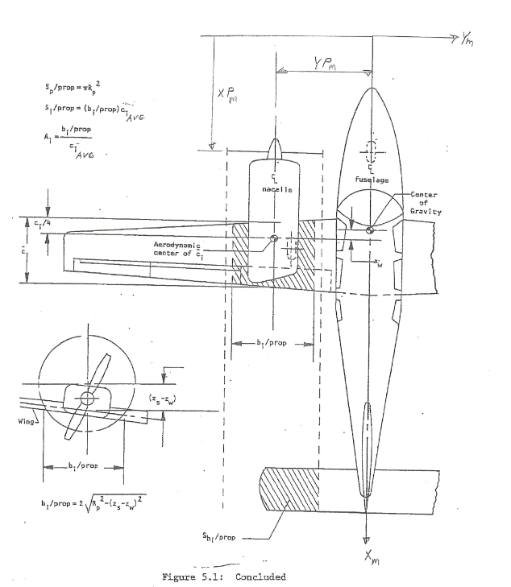
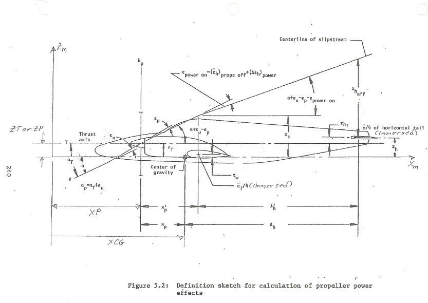
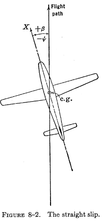
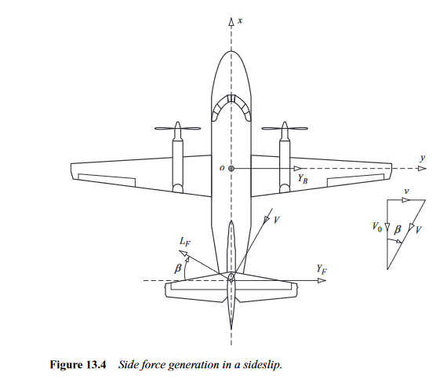
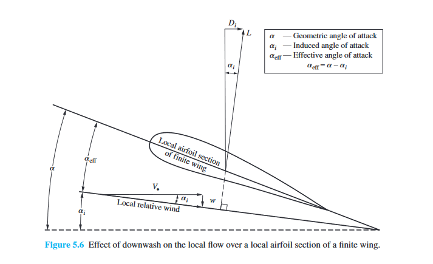
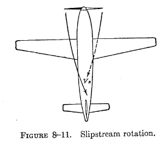
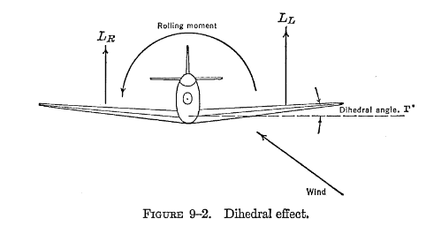

# Stability Analysis of an Aircraft
This repository contains code developed for the Stability Control Analysis of a D18 Beechcraft aircraft. 
Note: The Datcom manual was extensively used as a reference for the necessary graphs and data.

Topics Covered:

 1. Planform Geometric Parameterization

  
  Objective: Determine the aircraft's basic physical geometry, such as the theoretical wing area, span of the aircraft, mean chord length and location, etc... 

  Details: The PlanformParameterization object in the code is designed specifically for lifting surfaces like wings or horizontal tails (HT).
  

Fig 1. Datcom Manual page 2.2.2-1

2. Planform Aerodynamic Parameterization 

Objective: Apply aerodynamic parameterization to wing and HT but, it Can aslo be applied other planform such as Vertical Tails (VT) and Canards.   

Details: The code adjusts 2D (lower-case subscripts) aerodynamic parameters to 3D (upper-case subscripts). Experimental data, such as the lift curve slope, the coefficient of moment about the aerodynamic center, the zero lift angle of attack, and the aerodynamic center location, were obtained from "Theories of Wing Sections" by Abbot and Von Doenhoff or the Datcom Manual. Afterwards twist, compressibility, sweep, and aspect ratio were taken into account to shift parameters from 2D to 3D. These subcripts rule weren't applied in the code but were in the hand calculations.

Fig 2. Perkins and Hage, S&C Text Book page 23 

  
   
3. Actual Downwash Gradient Calculation 

   
Objective: Calculate the actual downwash gradient (dϵ/dα) on an aircraft.

Details: This calculation uses the aerodynamic and geometric parameters of the wing and horizontal tail to determine the downwash effect experienced by the tail due to the wing's presence. It considers the incidence angles of both the wing and the tail to provide an accurate representation of the downwash effect based on the aircraft's geometry. The effectiveness on the HT is dependent on the downwash since it determines what perecent of free stream dynamic pressure is seen by the tail. For example if it were to be fully immeresed (dϵ/dα ≈ .5) it would only so around 90% of the free-stream dynamic pressure , whilst if it was lets say dϵ/dα ≈ .4 the tail would see 95% of the free-stream dynamic pressure. These assumptions do not include power effects, which would make the HT experience a dynamic pressure ratio greater than the free-stream dynamic pressure.

Fig 3. Perkins and Hage, S&C Text Book page 215

  
  
4. Multhopp's Method vs Gilruth and White's Method

  
Objective: To determine the change in nose up pitching momement of with angle of attack as a coefficient (Cmαf). The goal was to obtain a Cmαf of -0.01 representing that the aircraft has 10% stability.

Details: There are many methods to Cmαf of the aircraft the three primary methods are Munk's, Gilruth and White's, and Multhopp's. Munk was the first to investigate this in 1924, using potential flow (inviscid) elements that are representative of a blimp (unfiorm flow with sources & sinks). This allowed him to define the pressure distribution over the streamline body establishing the a nose up pitching moment exists (destabalizing) which increases with Angle of Attack (AoA). 

Munk's analysis didn't take into account the upwash and downwash effect from the wings whilst G&W's and Muthlopp's did. The difference between the two is that G&W's method is an estimate the overall affect based of wind tunnel test data, whilst Multhopp's takes into account the local flow for ever section fwd and aft of the wing making it more percise and accurate than Munk's and G&W's. Lastly Multhopp's and G&W's method can both also be applied to engine naccelles or tip tanks.

Fig 4. Perkins and Hage, S&C Text Book page 227

5. Glider Stability Calculations

Objective: Determine the stick-fixed neutral point based off both (Cmαf) (G&W's and Multhopp's). 

Details: The stick-fixed neutral point is a location on the aircraft where the change in pitching moment with respect to AoA is 0, when the pilot is holding the yoke giving it the name stick fixed vs stick free. For a stick free analysis the elevators and their trims would need to be taken into account as well. A glider config will be analyzed first and will have the most aft neutral point. When more power is added the neutral point will move fwd and being the most fwd when at full power. The range limitations of the center of gravity (CG) is dependent on the range of the neutral point through its whole flight envelope. Which is why doing weight and balance on an aircraft for pre-flight is very important since it can have serious affects on the aircrafts performance.

Fig 5. Perkins and Hage, S&C Text Book page 247

  

6. Power Effects

Objective: Determine the new stick-fixed neutral points for the windmilling power and full power case.

Details: In section 5, it was mentioned that as we turn on and increase the power the neutral points will have a tendency to move fwd along the aircraft's Mean Aerodynamic Chord (MAC). Another affect is also the increase in downwash at the HT if it is within the streamline tube of the propeller slipstream or jet wash (not in a streamline tube). Knowing where the neutral point is at different power setting helps the engineer in determing how the fuel system and it's management system should be designed. Reason being is that displacing the fuel in the aircraft allows CG to shift to the appropriate location during different phases of flights or flight conditions.

 

Fig 6. Prof. Greiner's Notes

 

Fig 7. Prof. Greiner's Notes

7. Side Force Gradient

Objective: Determine the Side Force Gradient based off Wing-Body Interactions, VT interactions, and Props Effects with rudder fixed stability.

Details: An aircraft has a VT and Rudder control and trim to combat the side forces that can cause the aircraft to yaw. Knowing that there is a limit to the amount of side slip an aircraft can handle, having a slope in which engineers can use to determine the range of sideslip and sideforce the Aircraft can handle is important. For this part of the analysis we are only concerned about the sideforce due to wind vectors found at cruise since we can't provide rudder input as required by our rudder fixed condition. This is why there are no terms in the code inregards to engine out or crosswind conditions since they require rudder input. 

   

Fig 8. (LHS) Perkins and Hage, S&C Text Book page 316 

Fig 9. (RHS) Flight Dynamics Principles by Micheal V. Cook pg 352

8. Directional Stability

Objective: Determine the Directional Stability Slope (per deg) to remain at equilibrium with zero sideslip with rudder fixed stability. 

Details: Inregards to the rudder fixed condition the only terms used for calculations in this section are inregards to the Wing, Wing-Body, VT, and Propeller. The wing term is the sum of two hidden terms, corresponding to it's dihedral and sweep angles. Dihedral has a stabalizing effect on the planes rolling moment. Sweep increase the stabality affect of the dihedral when sideslipping since the local relative wind will see a weaker downward wind, signifying a weaker downwash. This can be seen in the figure below.

     

Fig 10. Fundemental of Aerodynamics by John D. Anderson pg 429

Fig 11. Perkins and Hage, S&C Text Book page 328 

9. Lateral Stability

  Objective: Determine the Lateral Stability Slope (per deg) to remain at a wings leveled position stick fixed condition.

  Details: Lateral stability deals with the aircrafts rolling moment and trying to maintain it at static equilibrium. For lateral stability there are 3 basic terms being the Wing, Wing-Body, and VT term. The wing term in this case contains four hidden terms attributed to the wing's Sweep, Aspect Ratio, Twist, and Dihedral. The purpose of dihedral and sweep are the same as mentioned under the 'Directional Stability' section. The reason aspect ratio is taken into account is that wings with higher aspect ratios have a higher moment of inertia limiting the amount of angular velocity it can obtain. Indicating the aspect ratio and manuverability have an inverse relationship. Moving onto twist, most planes have their wings twisted negatively (washout) so that when the aircraft stalls, the ailerons will still be able to provide lateral control. It also helps in reducing induced drag that is produced the vortices that the wings generate, which in turn gives the aircraft more stability due to a decrease in the amount of external forces its experiencing.

 

 Fig 12. Perkins and Hage, S&C Text Book page 343

